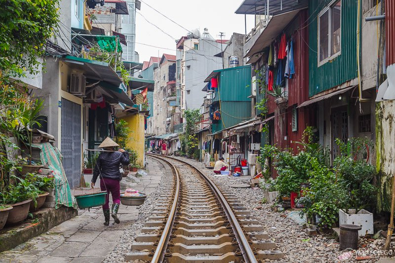

# Vietnam

### Table of Contents

- [Details](#details)
  - [Date](#date)
  - [Finance](#finance)
- [Itinerary](#itinerary)
  - [Day 1](#day-1)
  - [Day 2](#day-2)
  - [Day 3](#day-3)
  - [Day 4](#day-4)
  - [Day 5](#day-5)
  - [Day 6](#day-6)
  - [Day 7](#day-7)

## Details

### Date

- Dec 18 (Wed) - Dec 24 (Tue)
- 7 days and 6 nights

### Finance

- RM 1800 - RM 2000 per person
- [Splitwise][splitwise]

## Itinerary

### Day 1
> Dec 18 (Wed)

| Time          | Event                                       | Note                                      |
|---------------|---------------------------------------------|-------------------------------------------|
| 07:30 - 08:30 | Sunway University - KLIA2                   | Grab                                      |
| 12:05 - 14:20 | KLIA2 - Noi Bai International Airport       | Airplane; AK 512; Checked baggage 25 kg   |
| 16:00 - 17:00 | Noi Bai International Airport - Hanoi       | Bus; [Airport to Hanoi][airport-to-hanoi] |
| 17:30         | Check into Hanoi Zesty Hotel                | [Zesty][zesty]                            |
| 19:00         | Check out from Hanoi Zesty Hotel            |                                           |
| 21:30 - (05:30) | Hanoi - Lao Cai | [Train][train-to-sapa]                    |

### Day 2
> Dec 19 (Thu)

| Time          | Event                 | Note                       |
|---------------|-----------------------|----------------------------|
| (21:30) - 05:30 | Hanoi - Lao Cai (continued) | |
| 06:00 - 07:00 | Lao Cai - Sapa        | Taxi or bus to Sapa [Church][church] |
| ...            | Ger's Valley Homestay | [Ger][ger]                 |

### Day 3
> Dec 20 (Fri)

| Time          | Event                                | Note                                                                              |
|---------------|--------------------------------------|-----------------------------------------------------------------------------------|
| ...             | Ger's Valley Homestay (continued)                |                                                                                   |
| 15:30 - 21:30 | Sapa - Hanoi | Bus; [Sapa Bus Station][sapa-bus-station]; [Hanoi Bus Station][hanoi-bus-station] |
| 23:00         | Check into Awa Downtown Hostel       | [Awa][awa]                                                                        |

### Day 4
> Dec 21 (Sat)

| Time          | Event                              | Note                   |
|---------------|------------------------------------|------------------------|
| 07:30         | Check out from Awa Downtown Hostel |                        |
| 08:30 - 11:30 | Hanoi - Ha Long Bay                | Bus provided by cruise |
| ...             | Serenity Cruise                    | [Serenity][serenity]   |

### Day 5
> Dec 22 (Sun)

| Time          | Event                       | Note                   |
|---------------|-----------------------------|------------------------|
| ...             | Serenity Cruise (continued)             |                        |
| 12:00 - 15:00 | Ha Long Bay - Hanoi         | Bus provided by cruise |
| 15:30         | Check into Saitama Homestay | [Saitama][saitama]     |

### Day 6
> Dec 23 (Mon)

| Time | Event         | Note |
|------|---------------|------|
| ...    | Explore Hanoi |      |

### Day 7
> Dec 24 (Tue)

| Time          | Event                                 | Note                                    |
|---------------|---------------------------------------|-----------------------------------------|
| 05:30         | Check out from Saitama Homestay       |                                         |
| 06:00 - 07:00 | Hanoi - Noi Bai International Airport | Taxi                                    |
| 09:00 - 13:15 | Noi Bai International Airport - KLIA2 | Airplane; AK 517; Checked baggage 25 kg |
| 14:00         | KLIA2 - Sunway University             | Grab                                    |

[splitwise]: https://secure.splitwise.com/#/groups/13052688
[airport-to-hanoi]: http://excursionvietnam.com/get-to-hanoi-old-quarter-from-hanoi-airport
[zesty]: https://www.agoda.com/hanoi-zesty-hotel/hotel/hanoi-vn.html
[train-to-sapa]: https://12go.asia/en/train/hanoi/sapa?date=2019-12-18&people=4#!popup//secure.12go.asia:443/en/trip/43160-9279-9292?date=2019-12-18&travel_url=hanoi/sapa&direction=forward&change_date=0&ajax=1
[church]: https://www.indochinaodysseytours.com/vietnam/sapa/attractions-sapa-church.html
[ger]: https://www.facebook.com/SapaHomestay/
[sapa-bus-station]: https://12go.asia/en/station/10345-sa-pa-sapaexpress
[hanoi-bus-station]: https://12go.asia/en/station/10342-hanoi-sapaexpress
[serenity]: https://catbaexpress.com/serenity-cruises-2-days-tour.html
[saitama]: https://www.airbnb.com/rooms/26503593
[awa]: https://www.airbnb.com/rooms/27688599
